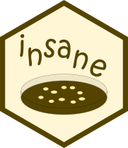

<!-- README.md is generated from README.Rmd. Please edit that file -->

```{r, echo = FALSE}
knitr::opts_chunk$set(
  collapse = TRUE,
  comment = "#>",
  fig.path = "man/figures/README-",
  out.width = "100%"
)
library(gifski)
gif_template <- gifski(
  png_files = list.files(
    path = dirname(knitr::opts_chunk$get("fig.path")), 
    pattern = "template_", 
    full.names = TRUE
  ), 
  gif_file = paste0(knitr::opts_chunk$get("fig.path"), "template.gif"), 
  width = 1920 * 2/3, height = 1080 * 2/3,
  delay = 3, 
  loop = TRUE, 
  progress = FALSE
)
# system("ffmpeg -i insane.mp4 -vf fps=1 insane%04d.png")
# gif_app <- gifski::gifski(
#   png_files = list.files("insane_gif", pattern = "*.png", full.names = TRUE), 
#   gif_file = "insane.gif", 
#   width = 1920 * 2/3, 
#   height = 1080 * 2/3,
#   delay = 1/3,
#   loop = TRUE, 
#   progress = FALSE
# )
gif_app <- list.files(
  path = dirname(knitr::opts_chunk$get("fig.path")), 
  pattern = "README-insane.gif", 
  full.names = TRUE
)
```

# insane: INsulin Secretion ANalysEr 

Shiny App to analyse insulin secretion (intially designed for EndoC-βH1 cell line).

```r
shiny::runGitHub("mcanouil/insane")
```
```{r, echo = FALSE}
knitr::include_graphics(gsub(".*/man", "man", gif_app))
```


## Overview

The Shiny (R package) application __insane__ (*INsulin Secretion ANalysEr*) provides a web interactive tool to import experiments of insulin secretion using cell lines such as EndoC-βH1.

1. [Excel Template](#excel-template)  
2. [The App](#The-App)  
    1. [Technical Quality-Control](#technical-quality-control)  
    2. [Statistical analyses](#statistical-analyses)  
    3. [List of Outliers (Issues Detected)](#list-of-outliers-issues-detected)

### Excel Template

An Excel template is provided within the app to help users import their experiments in an easy way.

```{r, echo = FALSE}
knitr::include_graphics(gsub(".*/man", "man", gif_template))
```

### The App

__insane__ provides a user-friendly interface which can handle several projects separately.

```{r, echo = FALSE}
knitr::include_graphics(paste0(knitr::opts_chunk$get("fig.path"), "app_001.png"))
```

#### Technical Quality-Control

__insane__ performs technical quality-control of the optical density measured in each steps of the experiments, *e.g.*:

* blank (*BLANK*), 
* lysat (*LYSAT*), 
* supernatant (*SN1* and *SN2*).  

This technical quality-control step checks:

* the variability among the duplicated optical density measures of each samples;
* the variability in the blank curves (intercept and slope estimated) among all experiments in a project.

```{r, echo = FALSE}
knitr::include_graphics(paste0(knitr::opts_chunk$get("fig.path"), "app_002.png"))
```

#### Statistical analyses 

__insane__ performs statistical analyses of the experimental conditions (if more than one), *e.g.* one silenced gene (*siGENE*) compared to an insulin secretion *reference* (*siNTP*) in two stimulation conditions (*Glc* and *Glc + IBMX*).

Conditions are compared using a linear regression with `Date` and `Operator` as covariates (if needed) to control for heterogeneity.

* Using all experiments in the selected project

    * Histogram version
    
        ```{r, echo = FALSE, out.width = "50%"}
        knitr::include_graphics(paste0(knitr::opts_chunk$get("fig.path"), "app_003.png"))
        ```

    * Boxplot version
    
        ```{r, echo = FALSE, out.width = "50%"}
        knitr::include_graphics(paste0(knitr::opts_chunk$get("fig.path"), "app_004.png"))
        ```

* Using some of the experiments in the selected project

    ```{r, echo = FALSE, out.width = "50%"}
    knitr::include_graphics(paste0(knitr::opts_chunk$get("fig.path"), "app_005.png"))
    ```

If and when some experiments are failing any of the technical quality-controls, a summary of the issues regarding the selected experiments can be displayed using the button `Show Issues in the Selected Experiments`.

```{r, echo = FALSE}
knitr::include_graphics(paste0(knitr::opts_chunk$get("fig.path"), "app_006.png"))
```


#### List of Outliers (Issues Detected)

A comprehensive list of all issues detected in the selected project is available in an `Outliers` tab.

```{r, echo = FALSE}
knitr::include_graphics(paste0(knitr::opts_chunk$get("fig.path"), "app_007.png"))
```

*Note*: The `Outliers` tab is displayed only if there is at least one issue in the selected project.
