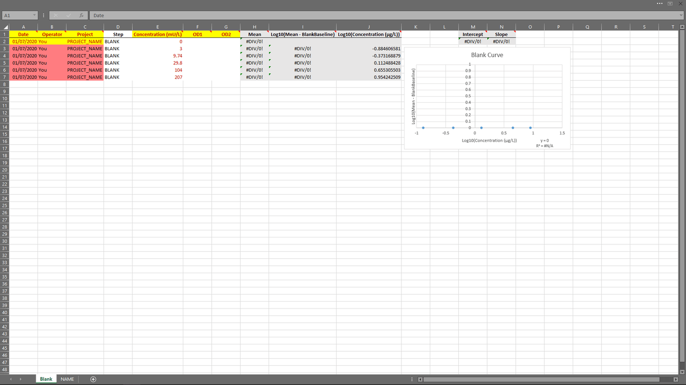
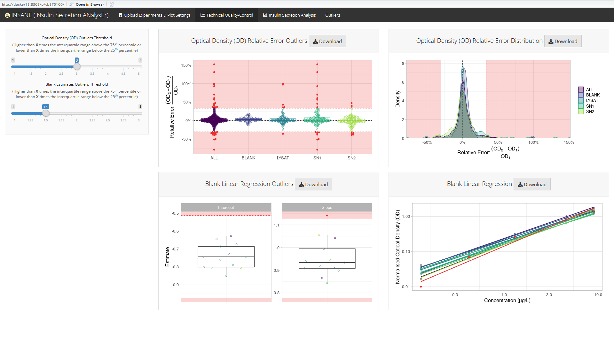
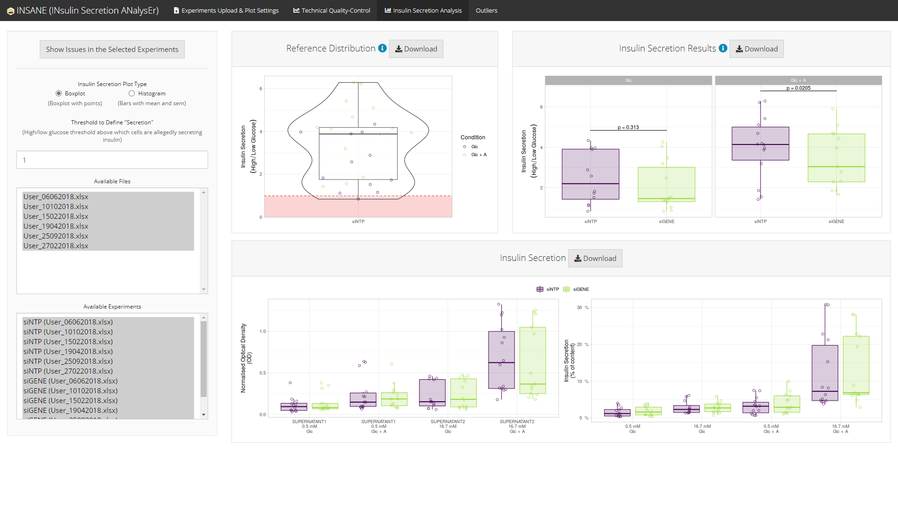
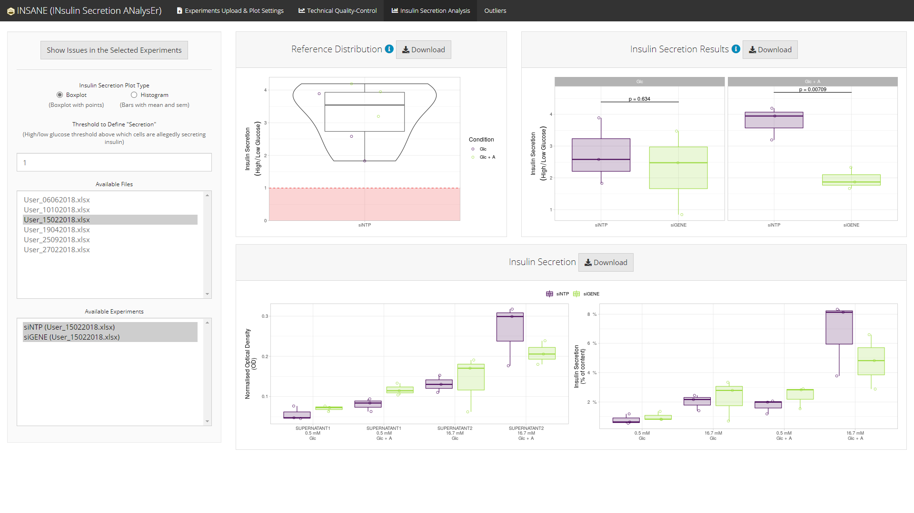
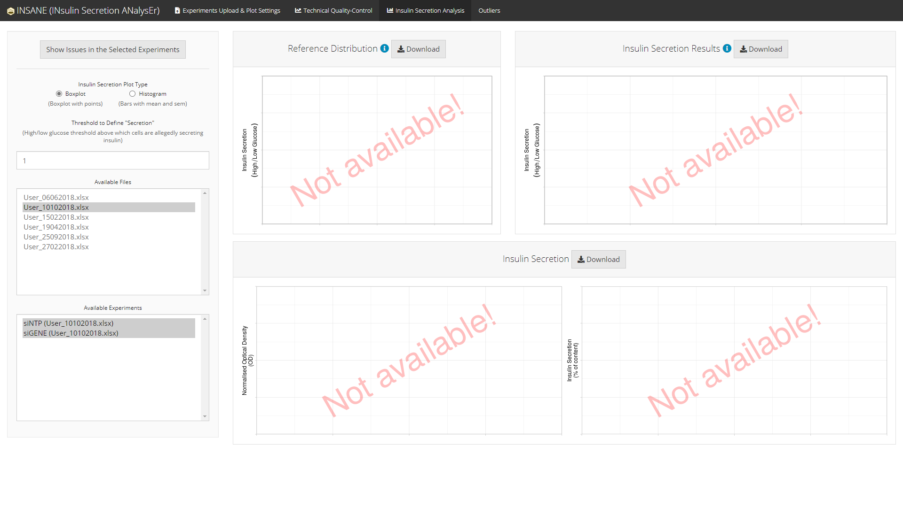

<!-- README.md is generated from README.Rmd. Please edit that file -->

# insane: INsulin Secretion ANalysEr 

Shiny App to analyse insulin secretion (intially designed for EndoC-βH1
cell line).

``` r
shiny::runGitHub("mcanouil/insane")
```


## Overview

The Shiny (R package) application **insane** (*INsulin Secretion
ANalysEr*) provides a web interactive tool to import experiments of
insulin secretion using cell lines such as EndoC-βH1.

1.  [Excel Template](#excel-template)  
2.  [The App](#The-App)
    1.  [Technical Quality-Control](#technical-quality-control)  
    2.  [Statistical analyses](#statistical-analyses)  
    3.  [List of Outliers (Issues
        Detected)](#list-of-outliers-issues-detected)

### Excel Template

An Excel template is provided within the app to help users import their
experiments in an easy way.



### The App

**insane** provides a user-friendly interface which can handle several
projects separately.


#### Technical Quality-Control

**insane** performs technical quality-control of the optical density
measured in each steps of the experiments, *e.g.*:

  - blank (*BLANK*),
  - lysat (*LYSAT*),
  - supernatant (*SN1* and *SN2*).

This technical quality-control step checks:

  - the variability among the duplicated optical density measures of
    each samples;
  - the variability in the blank curves (intercept and slope estimated)
    among all experiments in a project.



#### Statistical analyses

**insane** performs statistical analyses of the experimental conditions
(if more than one), *e.g.* one silenced gene (*siGENE*) compared to an
insulin secretion *reference* (*siNTP*) in two stimulation conditions
(*Glc* and *Glc + IBMX*).

Conditions are compared using a linear regression with `Date` and
`Operator` as covariates (if needed) to control for heterogeneity.

  - Using all experiments in the selected project
    
      - Histogram version
        
        
    
      - Boxplot version
        
        

  - Using some of the experiments in the selected project
    
    

If and when some experiments are failing any of the technical
quality-controls, a summary of the issues regarding the selected
experiments can be displayed using the button `Show Issues in the
Selected Experiments`.



#### List of Outliers (Issues Detected)

A comprehensive list of all issues detected in the selected project is
available in an `Outliers` tab.


*Note*: The `Outliers` tab is displayed only if there is at least one
issue in the selected project.
