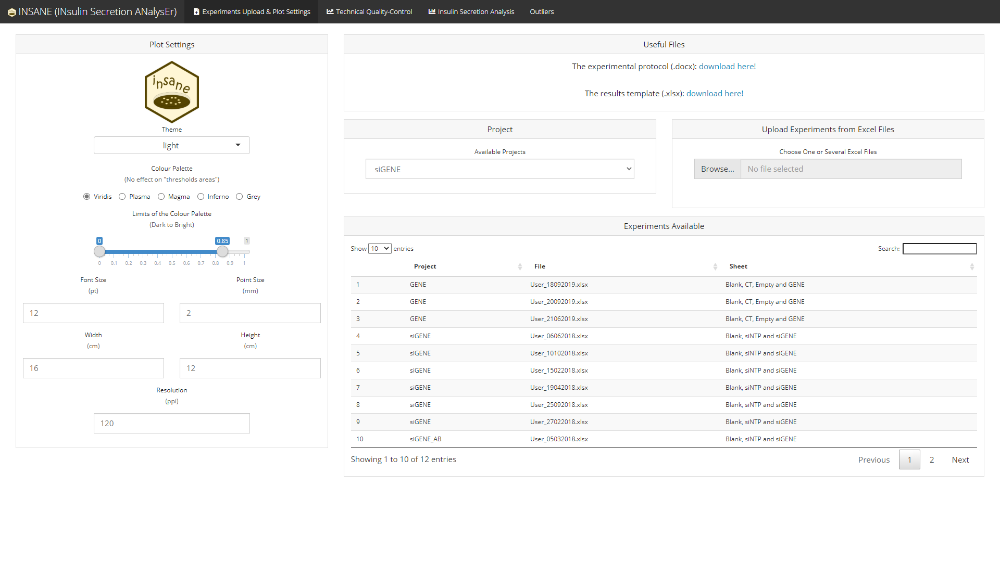

<!-- README.md is generated from README.Rmd. Please edit that file -->

# INsulin Secretion ANalysEr 

<!-- badges: start -->

[](https://www.tidyverse.org/lifecycle/#maturing)
[](https://github.com/mcanouil/insane)
[](https://github.com/mcanouil/insane/actions)
[](https://codecov.io/gh/mcanouil/insane)
[](https://cran.r-project.org/package=insane)
[](https://cran.r-project.org/web/checks/check_results_insane.html)
[](https://cran.r-project.org/package=insane)

<!-- badges: end -->

A user-friendly interface, using Shiny, to analyse glucose-stimulated
insulin secretion (GSIS) assays in pancreatic beta cells or islets.  
The package allows the user to import several sets of experiments from
different spreadsheets and to perform subsequent steps: summarise in a
tidy format, visualise data quality and compare experimental conditions
without omitting to account for technical confounders such as the date
of the experiment or the technician.  
Together, insane is a comprehensive method that optimises pre-processing
and analyses of GSIS experiments in a friendly-user interface.  
The Shiny App was initially designed for EndoC-betaH1 cell line
following method described in Ndiaye et al., 2017
([doi:\[10.1016/j.molmet.2017.03.011](doi:%5B10.1016/j.molmet.2017.03.011)\](<https://doi.org/10.1016/j.molmet.2017.03.011>)).

## Installation

``` r
# Install insane from CRAN:
install.packages("insane")

# Or the the development version from GitHub:
# install.packages("remotes")
remotes::install_github("mcanouil/insane")
```

``` r
library("insane")
go_insane()
```


## Overview

The Shiny (R package) application **insane** (*INsulin Secretion
ANalysEr*) provides a web interactive tool to import experiments of
insulin secretion using cell lines such as EndoC-βH1.

1.  [Excel Template](#excel-template-top)  
2.  [The App](#the-app-top)
    1.  [Technical Quality-Control](#technical-quality-control-top)  
    2.  [Statistical analyses](#statistical-analyses-top)  
    3.  [List of Outliers (Issues
        Detected)](#list-of-outliers-issues-detected-top)

### Excel Template ([top](#overview))

An Excel template is provided within the app to help users import their
experiments in an easy way.


### The App ([top](#overview))

**insane** provides a user-friendly interface which can handle several
projects separately.



#### Technical Quality-Control ([top](#overview))

**insane** performs technical quality-control of the optical density
measured in each steps of the experiments:

  - blank (*BLANK*),
  - lysat (*LYSATE*),
  - supernatant (*SUPERNATANT1* and *SUPERNATANT2*).

This technical quality-control step checks:

  - the variability among the duplicated optical density measures of
    each samples;
  - the variability in the blank curves (intercept and slope estimates)
    among all experiments in a project.


#### Statistical analyses ([top](#overview))

**insane** performs statistical analyses of the experimental conditions,
*e.g.*, one silenced gene (*siGENE*) compared to an insulin secretion
*reference* (*siNTP*) in two stimulation conditions (*Glc* and *Glc +
A*).

Conditions are compared using a linear regression with `Date` and
`Operator` as covariates (if needed) to control for heterogeneity.

  - Using all experiments in the selected project
    
      - Boxplot version
        
        
    
      - Histogram version
        
        

  - Using some of the experiments in the selected project
    
    

If and when some experiments are failing any of the technical
quality-controls, a summary of the issues regarding the selected
experiments can be displayed using the button `Show Issues in the
Selected Experiments`.


#### List of Outliers (Issues Detected) ([top](#overview))

A comprehensive list of all issues detected in the selected project is
available in an `Outliers` tab.


*Note*: The `Outliers` tab is displayed only if there is at least one
issue in the selected project.

## Getting help

If you encounter a clear bug, please file a minimal reproducible example
on [github](https://github.com/mcanouil/insane/issues).  
For questions and other discussion, please contact the package
maintainer.

-----

Please note that this project is released with a [Contributor Code of
Conduct](https://github.com/mcanouil/insane/blob/master/.github/CODE_OF_CONDUCT.md).  
By participating in this project you agree to abide by its terms.
