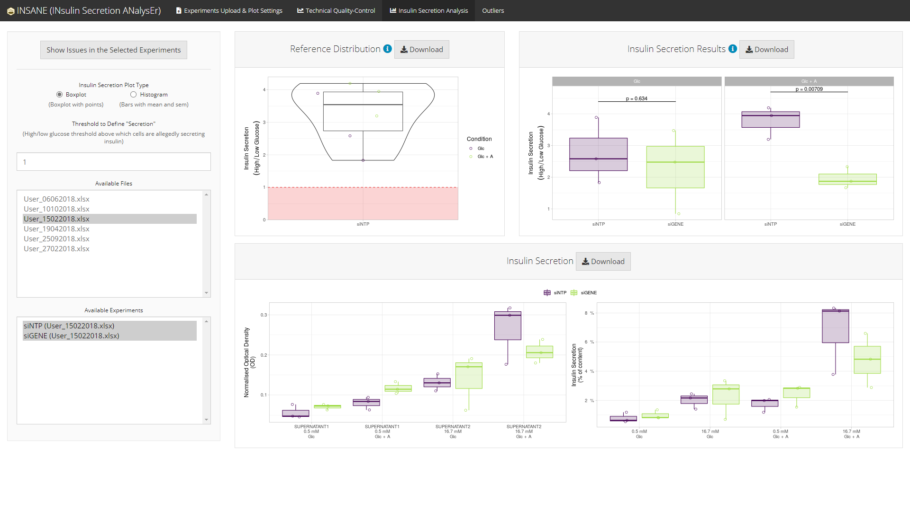

```{r, include = FALSE}
knitr::opts_chunk$set(
  collapse = TRUE,
  comment = "#>",
  fig.path = "README-",
  out.width = "100%"
)
```

```{r logo, echo = FALSE, out.width = "150px", fig.align = "center"}
knitr::include_graphics(path = "insane.png")
```

# Installation

```{r, eval = FALSE}
# Install insane from CRAN:
install.packages("insane")

# Or the the development version from GitHub:
# install.packages("remotes")
remotes::install_github("mcanouil/insane")
```

```{r, eval = FALSE}
library("insane")
go_insane()
```


# Overview

The Shiny (R package) application __insane__ (*INsulin Secretion ANalysEr*) provides a web interactive tool to import experiments of insulin secretion using cell lines such as EndoC-βH1.

## Excel Template

An Excel template is provided within the app to help users import their experiments in an easy way.

## The App

__insane__ provides a user-friendly interface which can handle several projects separately.

```{r, echo = FALSE}
knitr::include_graphics("README-app_001.png")
```

### Technical Quality-Control

__insane__ performs technical quality-control of the optical density measured in each steps of the experiments:

* blank (*BLANK*), 
* lysat (*LYSATE*), 
* supernatant (*SUPERNATANT1* and *SUPERNATANT2*).  

This technical quality-control step checks:

* the variability among the duplicated optical density measures of each samples;
* the variability in the blank curves (intercept and slope estimates) among all experiments in a project.

```{r, echo = FALSE}

```

### Statistical analyses

__insane__ performs statistical analyses of the experimental conditions, *e.g.*, one silenced gene (*siGENE*) compared to an insulin secretion *reference* (*siNTP*) in two stimulation conditions (*Glc* and *Glc + A*).

Conditions are compared using a linear regression with `Date` and `Operator` as covariates (if needed) to control for heterogeneity.

* Using all experiments in the selected project

    * Boxplot version
    
        ```{r, echo = FALSE, out.width = "50%"}
        knitr::include_graphics("README-app_003.png")
        ```

    * Histogram version
    
        ```{r, echo = FALSE, out.width = "50%"}
        knitr::include_graphics("README-app_004.png")
        ```

* Using some of the experiments in the selected project

    ```{r, echo = FALSE, out.width = "50%"}
    
    ```

If and when some experiments are failing any of the technical quality-controls, a summary of the issues regarding the selected experiments can be displayed using the button `Show Issues in the Selected Experiments`.

```{r, echo = FALSE}
knitr::include_graphics("README-app_006.png")
```


### List of Outliers (Issues Detected)

A comprehensive list of all issues detected in the selected project is available in an `Outliers` tab.

```{r, echo = FALSE}
knitr::include_graphics("README-app_007.png")
```

*Note*: The `Outliers` tab is displayed only if there is at least one issue in the selected project.
